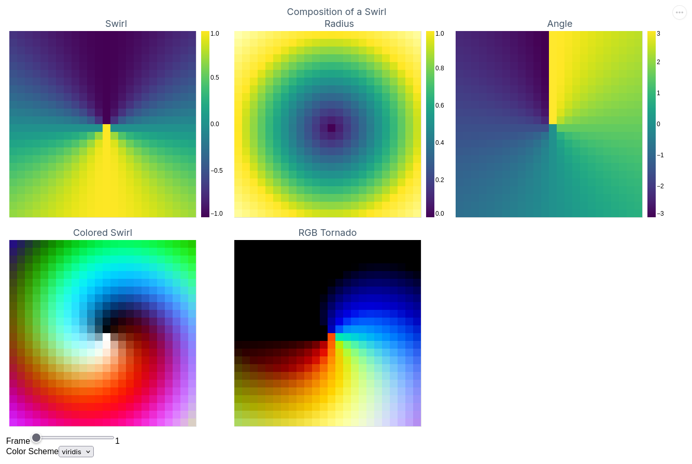

# KinoRewind

```elixir
[swirl, radius, angle, colored, tornado]
|> TensorPlot.plot(
  concat: :wrappable,
  columns: 3,
  cmap: :viridis,
  cmaps: ["viridis", "blues", "greys"],
  size: 360,
  titel: "Composition of a Swirl",
  labels: ["Swirl", "Radius", "Angle", "Colored Swirl", "RGB Tornado"]
)
```



KinoRewind is a helper module for rendering 3D and 4D `Nx.Tensor`s as sequence of images or single image in [Livebook](https://livebook.dev/) via [VegaLite](https://github.com/livebook-dev/vega_lite).

## Installation


In Livebook add `kino_rewind` to your dependencies:

```elixir
Mix.install([
  {:nx, "~> 0.10.0"},
  {:kino, "~> 0.18.0"},
  {:image, "~> 0.62.1"},
  # add this:
  {:kino_rewind, "~> 0.1.0"}
])
```

## Example

[](https://livebook.dev/run?url=https%3A%2F%2Fgithub.com%2Flaszlokorte%2Fkino_rewind%2Fblob%2Fmain%2Fguides%2Fexample.livemd)

Inside Livebook a list of `Nx.Tensors` can be rendered like this:

```elixir
rad = 12
dx = Nx.iota({rad * 2, 1}) |> Nx.subtract(rad) |> Nx.divide(rad)
dy = Nx.iota({1, rad * 2}) |> Nx.subtract(rad) |> Nx.divide(rad)
dx2 = Nx.pow(dx, 2)
dy2 = Nx.pow(dy, 2)
radius = Nx.add(dx2, dy2) |> Nx.sqrt()
angle = Nx.atan2(dy, dx)

[radius, angle, dx, dy]
|> TensorPlot.plot(
  concat: :wrappable,
  columns: 4,
  cmap: :viridis,
  size: 360,
  titel: "Imagees",
  labels: ["Radius", "Angle", "DX", "DY"]
)
```
